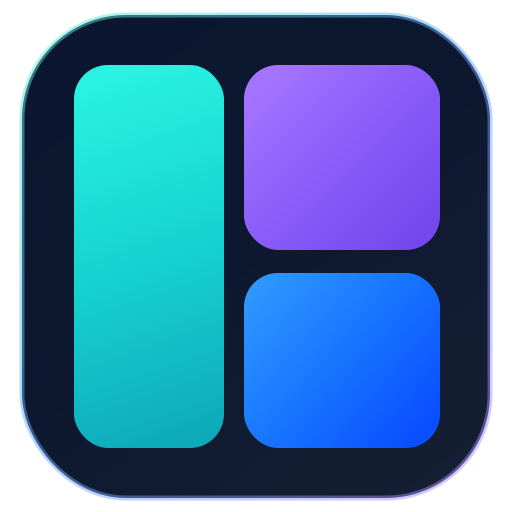

<h1 align="center">
  
  <br>
  Plat
</h1>

<p align="center">
  Composable pane layouts for Flutter.
  <br>
  Split panes, tab groups, drag-and-drop, and controller-driven workspaces.
</p>

<p align="center">
  <a href="#about">About</a> ·
  <a href="#features">Features</a> ·
  <a href="#getting-started">Getting started</a> ·
  <a href="#layout">Layout</a> ·
  <a href="#customization">Customization</a>
</p>

## About

Plat is a highly customizable and flexible package for building workspace
layouts, from simple split panes to complex IDE-style editors. It manages tab
groups, resizable splits, drag-and-drop, focus, immutable snapshots, and
undoable structural changes while leaving pane content and styling to the
application.

## Features

- **Split workspaces**: Compose rows, columns, slots, leaves, and tab groups.
- **Tab workflows**: Reorder, drag, pin, lock, preview, close, and move tabs.
- **Drag-and-drop layouts**: Move tabs or panes within one view or across views.
- **Resizable panes**: Mix fixed, fractional, auto, minimum, and maximum extents.
- **Controller commands**: Focus, close, insert, split, hide, maximize, undo, and redo.
- **Stable snapshots**: Read immutable layout state from ids without owning the tree.
- **Drop policies**: Accept or reject drops by source controller, target, and zone.
- **Composable styling**: Theme dividers, drop hints, tab bars, and tab chips.
- **Keyboard actions**: Built-in shortcuts for common focus and layout operations.

## Getting started

Add `plat` to your Flutter app:

```sh
flutter pub add plat
```

Or add it manually:

```yaml
dependencies:
  plat: ^0.1.0
```

Then import the package:

```dart
import 'package:plat/plat.dart';
```

## Layout

A `Plat` tree describes the shape of the workspace. Most layouts are built
from a small set of public values:

- `Plat`: a row, column, tab group, slot, or leaf.
- `Plat.row` / `Plat.column`: split children horizontally or vertically.
- `Plat.tabs`: group tabs and render the active tab's child.
- `PlatTab`: tab metadata such as title, pinned, locked, and preview state.
- `Plat.leaf`: a content endpoint rendered by your `leafBuilder`.
- `Plat.slot`: an optional shell region that can stay empty or bound maximize.
- `id`: stable string identity for builders, focus, drops, and commands.
- `PlatSize` / `PlatExtent`: fixed, fractional, auto, and resizable space.

```dart
final controller = PlatController(
  initialPlat: .row(
    children: [
      .tabs(
        [
          .leaf(id: 'main', title: 'main.dart'),
          .leaf(id: 'readme', title: 'README.md'),
        ],
        id: 'editors',
      ),
      const .slot(
        id: 'inspector',
        size: .fixed(.pixel(280)),
        child: .leaf(id: 'inspector-pane', title: 'Inspector'),
      ),
    ],
  ),
);
```

## Rendering

`PlatView` renders the controller tree. Your app provides the leaf content;
Plat handles pane chrome, tab interactions, dividers, drops, shortcuts, and
focus state. Switch on `leaf.id`, `leaf.title`, or `leaf.data` when different
panes need different widgets.

```dart
PlatView(
  controller: controller,
  leafBuilder: (context, leaf) => switch (leaf.id) {
    'inspector-pane' => InspectorPane(leaf: leaf),
    _ => EditorPane(leaf: leaf),
  },
);
```

## Controller

Use `PlatController` for commands that change the workspace. Most structural
changes are recorded for undo and redo.

```dart
controller.insertTab(
  tabGroupId: 'editors',
  tab: .leaf(id: 'settings', title: 'Settings'),
);

controller.split(
  targetId: 'main',
  side: .right,
  sibling: .tabs([
    .leaf(id: 'preview', title: 'Preview'),
  ]),
);

controller.close('readme');
controller.undo();
```

## Customization

### Theme

Plat works without theme configuration. When a matching Plat tab field is not
set, the default chrome reads from `ThemeData.tabBarTheme` for tab colors, text
styles, overlays, dividers, and cursors before falling back to Plat defaults.

Use `PlatTheme` for package-wide visual changes. It covers tab bars, tab chips,
split dividers, drop hints, and animation timing.

```dart
PlatTheme(
  data: const PlatThemeData(
    divider: PlatDividerTheme(thickness: 2, hitSlop: 6),
    dropHint: PlatDropHintTheme(duration: Duration(milliseconds: 160)),
    tabBar: PlatTabBarTheme(
      size: 36,
      fit: .expand,
      chipMinWidth: 72,
      chipMaxWidth: 220,
      labelPadding: .symmetric(horizontal: 10),
    ),
  ),
  child: PlatView(
    controller: controller,
    leafBuilder: (context, leaf) => switch (leaf.id) {
      'inspector-pane' => InspectorPane(leaf: leaf),
      _ => EditorPane(leaf: leaf),
    },
  ),
);
```

### Tab chrome

When one tab group needs custom chrome, return a `PlatTabBar` from
`PlatView.tabBar`. For custom tab contents, reuse the default chip and replace
only the slots your app needs.

```dart
PlatView(
  controller: controller,
  tabBar: (context, tabs) => PlatTabBar(
    tabBuilder: (context, tab) => PlatTabChip(
      leading: const Icon(Icons.description, size: 14),
      label: Text(tab.snapshot.title),
      trailing: const PlatTabCloseButton(),
    ),
  ),
  leafBuilder: (context, leaf) => switch (leaf.id) {
    'inspector-pane' => InspectorPane(leaf: leaf),
    _ => EditorPane(leaf: leaf),
  },
);
```

## Multiple views

Start with one `PlatView` for most workspaces. Rows, columns, tab groups, and
slots can model deeply nested layouts inside one controller. Use multiple
`PlatView`s when separate app regions or controllers should still exchange
tabs, filter cross-view drops, or preserve leaf widget state during handoff.

```dart
Widget buildPane(BuildContext context, LeafSnapshot leaf) {
  return switch (leaf.id) {
    'inspector-pane' => InspectorPane(leaf: leaf),
    _ => EditorPane(leaf: leaf),
  };
}

PlatScope(
  child: Row(
    children: [
      Expanded(
        child: PlatView(
          controller: mainController,
          leafBuilder: buildPane,
        ),
      ),
      Expanded(
        child: PlatView(
          controller: sideController,
          leafBuilder: buildPane,
          autofocus: false,
          dropPolicy: (attempt) => attempt.sourceController == mainController,
        ),
      ),
    ],
  ),
);
```
